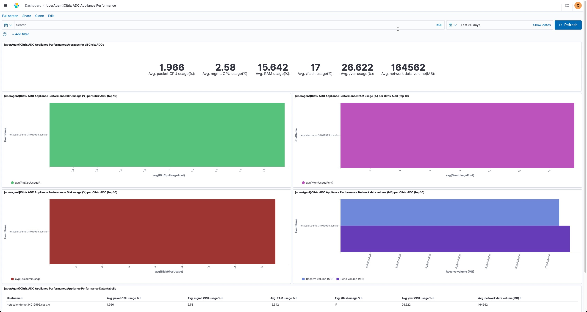
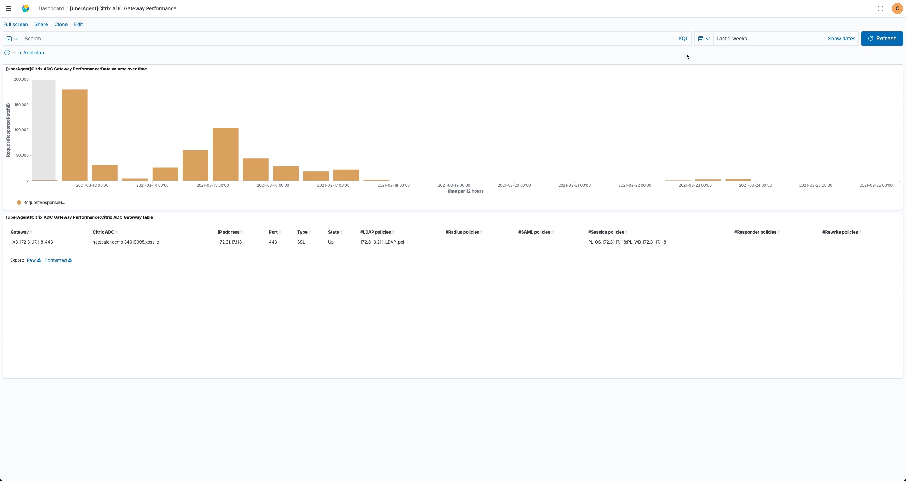
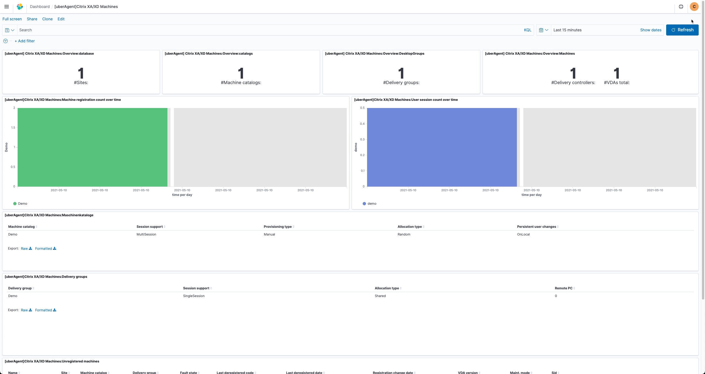
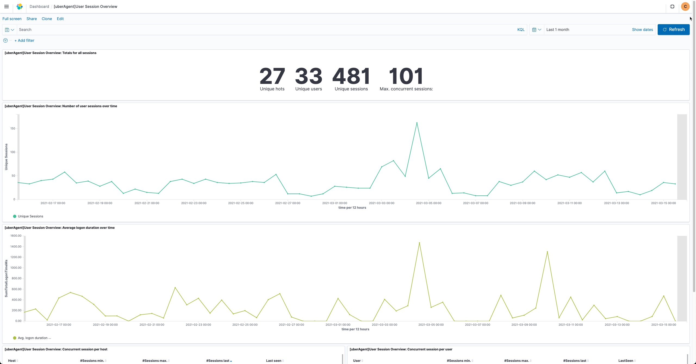

# Introduction

Experimental support for Elasticsearch was added to uberAgent in version 3.6.0. This allows uberAgent to send data to Elasticsearch, 
which can then be visualized in Kibana. This repository contains community dashboards for Kibana and OpenSearch.

You can read about the details here: https://uberagent.com/blog/uberagent-3-6-brings-support-elasticsearch/

## Why This Repository?

The guys from uberAgent do not deliver Dashboards for Kibana or OpenSearch. So we thought it would be a good idea to start with it.
We implemented a lot of basic dashboards and have decided to make those available to the community. This way the community can collaborate on them and bring them together to the next level.

## Configure uberAgent for ElasticSearch / OpenSearch

The configuration for a Elasticsearch / OpenSearch connection is done in the uberAgent configuration file. The default location for the configuration file is:

```
[Receiver]
Name = Default
Type = Elasticsearch
Protocol = HTTP
Servers = http://servername:9200
# The setting RESTToken is required if X-Pack security is enabled. It is enabled by default since Elasticsearch version 8.
RESTToken = username:password
```

Read more about the ElasticSearch installation here: https://uberagent.com/docs/uberagent/latest/installation/backend/installing-elasticsearch/

### When Using Proxies

uberAgent uses [libCurl](https://curl.se/libcurl/) for communication/transfer.

So if you are using a proxy inside your company you need to configure the llient as below:

- Two system variables have to be set in order to make uberAgent work with a proxy

    - http_proxy ***address:port***
    - https_proxy ***address:port***

> The system variables are being handed over to the uberAgent PSADT installation packages if a proxy address is entered.

## Dashboards

> These dashboards are meant to be used in a local Kibana or OpenSearch instance.

### Analyze data over time

This dashboard lets you interactively analyze any filtered subset of your data over time.

We created more than one dashboard in Opensearch to show all the available data.

#### Analyze data over time: Browser IE


#### Analyze data over time: Outlook Plugin Load Performance


#### Analyze data over time: Process Startup


#### Analyze data over time: Browser Chrome


#### Analyze data over time: Network Performance


#### Analyze data over time: Session 0


#### Analyze data over time: Machine GPU Usage


#### Analyze data over time: User Sessions


### Application Errors

This dashboard displays information about application errors (crashes and hangs).


### Application Inventory

This dashboard displays inventory information about the installed applications.


### Application Network Issues

This dashboard displays information about reconnections, retransmissions and failed TCP network connections. It can be used to identify application misconfigurations, missing firewall rules or network and service outages.


### Application Ul Unresponsiveness

This dashboard displays information about times of unresponsiveness, i.e. when application user interfaces do not react to user input. Events are generated every time applications do not process window messages for 200 ms (or longer).


### Application Usage

This dashboard displays information about actual application usage.


### Boot Delays

This dashboard displays information about applications, services and drivers that caused boot delays. The events that are processed here are generated only when a delay occurs. The data displayed here does not reflect typical boot processes.


### Boot Duration

This dashboard displays information about the duration of system boots. A boot process starts when Windows is loading and is finished when the desktop is displayed and the load has dropped to 20%.


### Browser Performance: Chrome

This dashboard displays detailed information about Chrome's resource usage by process type. The most common process types are: browser (main process), tab (rendering), GPU (GPU acceleration), extension (runs extensions), flash (runs Flash).


### Browser Performance: Internet Explorer

This dashboard displays the resources consumed per website. Each site's performance is calculated across all user sessions and instances of Internet Explorer.


### Browser Web App Performance

This dashboard displays detailed information for page loads and background data transfers (XMLHttpRequests and web socket handshake requests). Data is collected via browser extensions, which must be installed in addition to the endpoint agent. "Tab URL" stands for the URL entered in the browser's address bar; "Request URL" stands for an address the browser exchanged data with.


### Browser Web App Usage

This dashboard displays information about web app as well as browser usage. Data is collected via browser extensions, which must be installed in addition to the endpoint agent.


### Citrix ADC Appliance Performance

This dashboard displays performance information about Citrix ADC appliances monitored with uberAgent. uberAgent only collects performance data from the primary Citrix ADC.



### Citrix ADC Gateway Performance

This dashboard displays information about gateways on Citrix ADCs monitored with uberAgent. uberAgent only collects performance data from the primary Citrix ADC.



### Citrix ADC Inventory

This dashboard displays inventory information about the Citrix ADCs monitored with uberAgent. uberAgent collects inventory data from the primary as well as secondary Citrix ADC.


### Citrix ADC Virtual Server Performance

This dashboard displays performance information about virtual servers on Citrix ADCs monitored with uberAgent. uberAgent only collects performance data from the primary Citrix ADC.


### Citrix XA/XD Applications & Desktops

This dashboard displays detailed information about published applications and desktops in Citrix XenApp/XenDesktop. It requires uberAgent to be installed on at least one delivery controller per site (XA/XD 7.6 or newer).


### Citrix XA/XD Databases

This dashboard displays detailed information about Citrix XenApp/XenDesktop databases. It requires uberAgent to be installed on at least one delivery controller per site (XA/XD 7.6 or newer).


### Citrix XA/XD Licensing

This dashboard displays detailed information about Citrix XenApp/XenDesktop licensing. It requires uberAgent to be installed on at least one delivery controller per site (XA/XD 7.6 or newer).


### Citrix XA/XD Machines

This dashboard displays detailed information about machines in Citrix XenApp/XenDesktop sites. It requires uberAgent to be installed on at least one delivery controller per site (XA/XD 7.6 or newer).



### Data Volume

This dashboard displays information about the volume of data generated by uberAgent. It is based on data from license_usage.log, stored in the _internal index on the Splunk license master. If this dashboard is empty, configure forwarding of the license master's _internal index to your indexers. In larger implementations the data volume cannot be determined per individual host due to squashing. Please note that enabling ESA also increases the UXM data volume because additional fields are populated in UXM sourcetypes, too.


### Experience Score

This dashboard displays a high level overview of your environment. The lowest score is 0.0. The highest score is 10.0. The higher, the better. The data is updated every full and half hour. Click on a value of interest, to get a drilldown.

### Licensing Status

This dashboard displays information about the licensing status of uberAgent. It can only display information about licenses that are in use. If you have licenses on your machines that are not currently used they will not appear here.


### Machine GPU

This dashboard displays detailed information about GPU usage per machine.


### Machine Inventory

This dashboard displays inventory information about the endpoints monitored with uberAgent.


### Machine Network Configuration

This dashboard displays network configuration information about the endpoints monitored with uberAgent.


### Machine Performance

This dashboard displays detailed information about machine performance. The terms 'machine' and 'host' are used interchangeably.


### Machine Storage

This dashboard displays information about disk drives and volumes.


### Machine Uptime

This dashboard shows each host's uptime (days since last boot).


### Network Communication

This dashboard displays detailed information about network communication per application, process, host, target or user.


### Outlook Plugin Load Performance

This dashboard displays information about the load performance of Microsoft Outlook plugins.


### Process GPU

This dashboard displays detailed information about GPU usage per application or process.


### Process Performance

This dashboard displays detailed information about process performance.


### Process Startup

This dashboard displays detailed information about process startup performance.


### SBC Sizing and Capacity Planning

This dashboard displays relevant information for sizing server-based computing farms (RDS/XenApp).


### Session 0

This dashboard displays detailed information about session 0 on all machines. Sesssion 0 is the session that is used for services and user-mode drivers.


### Session Info: Citrix

This dashboard displays detailed information about Citrix ICA/HDX sessions.


### Session Info: VMware

This dashboard displays detailed information about VMware RDP/PCoIP sessions.

### Shutdown Delays

This dashboard displays information about applications, services and drivers that caused shutdown delays. The events that are processed here are generated only when a delay occurs. The data displayed here does not reflect typical shutdown processes.


### Shutdown Duration

This dashboard displays information about the duration of system shutdowns. The events that are processed here are generated only when a delay occurs. The data displayed here does not necessarily reflect typical shutdown processes.


### Single Application Inventory

This dashboard displays the installed versions of a specific application over time. It also shows detailed information about each installation. Please note that inventory information is only collected once per 24 hour period by default.


### Single Application Performance

This dashboard displays detailed information about a specific application's performance.


### Single Boot

This dashboard displays information about a specific boot process.


### Single Citrix ADC Inventory

This dashboard displays details for a Citrix ADC. Please note that inventory information is only collected once per 24 hour period by default. uberAgent collects inventory data from the primary as well as secondary Citrix ADC.


### Single Logoff

This dashboard displays all available information about one specific logoff.


### Single Logon

This dashboard displays all available information about one specific logon.


### Single Machine Inventory

This dashboard displays the number of application installations over time. It also shows detailed information about each installed application and each installed software update. Please note that inventory information is only collected once per 24 hour period by default.


### Single Update Inventory

This dashboard displays the install count of a specific update over time. It also shows detailed information about each installation. Please note that inventory information is only collected once per 24 hour period by default.


### Single User Detail

This dashboard displays detailed information about a specific user account.

### Single Virtual Server Performance

This dashboard displays performance information about virtual servers and bound services as well as service groups. uberAgent only collects performance data from the primary Citrix ADC.

### SMB Client Performance

This dashboard displays information about the performance of SMB connections to shares on the network.


### Standby/Resume Delays

This dashboard displays information about applications, services and drivers that caused delays while entering or resuming from standby. The events that are processed here are generated only when a delay occurs. The data displayed here does not reflect typical standby or resume processes.


### Standby/Resume Duration

This dashboard displays information about the duration of system standby and resume processes.

### Stop Errors (Blue Screen & Power Loss)

This dashboard displays detailed information about three different types of stop errors: blue screen of death, hard power off and random restart. A blue screen is displayed when the system detects it cannot continue due to an error condition and stops after collecting rudimentary information. A hard power off happens when the user presses and holds the power button for at least 4 seconds. A random restart may be due to power loss or a hard hang; in either case the system cannot generate a blue screen any more.


### uberAgent Versions

This dashboard shows which uberAgent versions are active on the endpoints.


### Update Inventory

This dashboard displays inventory information about the installed software updates. The Windows 10 OS build number reflects a machine's update state in a single number.


### User Logoff Duration

This dashboard displays information about the duration of user logoffs.


### User Logon Duration

This dashboard displays information about the duration of user logons.


### User Logon Duration - Group Policy

This dashboard displays detailed group policy processing times.


### User Session Overview

This dashboard displays a session status overview. Many more detailed dashboards can be accessed through the menu above.



### User Sessions

This dashboard displays detailed information about user sessions.


